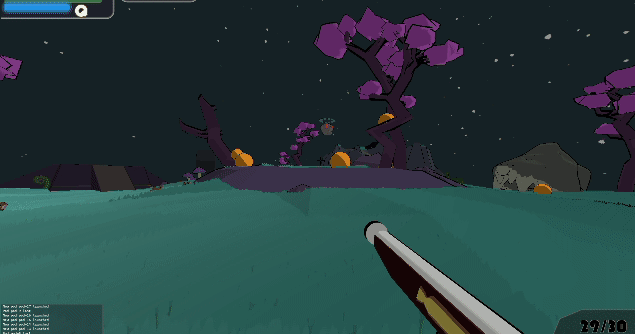

# Attack of the Chaos Monkeys (AotCM)

This repo contains the source code and assets for a Kubernetes FPS shooter where you defend your cluster of pods. The gates have been opened for the chaos monkeys to flood forth. How long can you and your precious pods survive?


## Controls

* __Movement__: `WASD-keys`
* __Shoot__: `Left-click`
* __Jump__: `Spacebar`
* __Special ability__: `Q`

## Game overview

The goal of the game is defend the orange pods that will be scattered around the map from the invading monkeys.

Chaos monkeys will be entering the world through blue portals that randomly appear around the small map. Keep an eye our for them so you know which direction the monkeys will come from.

If the monkeys hit you enough or you fall off the map you will die. You will then respawn after a few seconds delay, giving the monkeys free range to wreak havoc until your return.

If playing the survival you will lose when the number of lost pods reaches `25`. Be aware that in this mode the difficulty will also ramp up making it an endurance to see how long you can last.

Your Kubelet friend will be launching the pods from the middle of the field. Do not forget to utilize his awesome power by pressing `Q` when the blue power meter is full.



## Kubernetes integration

It is possible to connect the game to your Kubernetes cluster by opening a `kubectl` proxy. The game will then use the Kubernetes HTTP API through the opened port to read the list of pods and send commands to kill them when they are destroyed in the game. If the Kubernetes API would change in the future this integration could become broken.

To open a proxy on port `8080`:
```
kubectl proxy --port=8080
```

It is also possible to limit the pods used to a single Kubernetes namespace.

NOTE: This integration has not been production tested and is not recommended for serious use cases. 

## Disclaimer

This project and all assets including source code, 3D models, music and audio (except for a few royalty free audio clips) have been produced by yours truly. I am not an artist or a music composer so be aware that the art and music is quite rough around the edges.
It was also my first project in Godot *(started from the official FPS tutorial)* so the code has smell of spaghetti in some parts as I was getting used to the composition based structuring of scenes.

The game has mostly been tested on my own machine and system, so please create an issue if you meet any problems.

Please feel free to use contained assets. I doubt that they would make it into a final product of something, but attribution would be appreciated in that case!